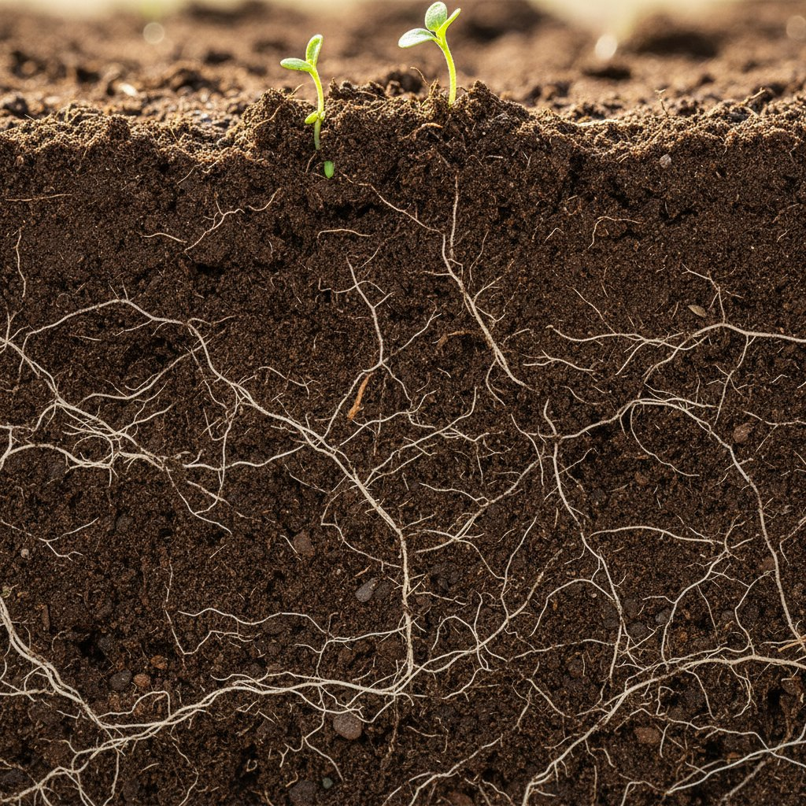
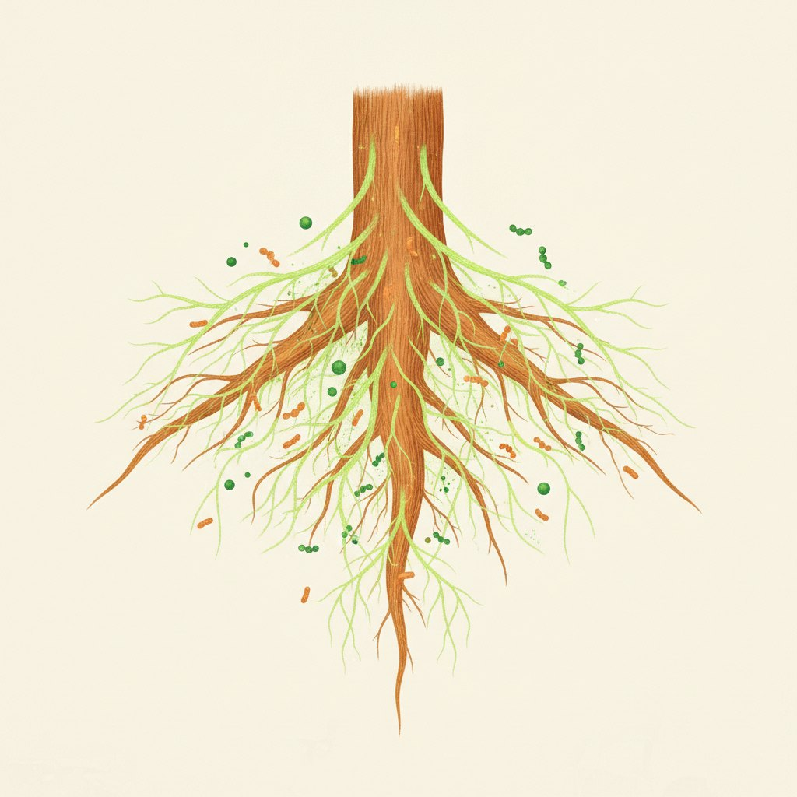

<!-- _paginate: false -->
<!-- _footer: '' -->

Beyond Biomes

# Precision medicine for living soil

We read a field's living soil — then deliver a custom biome that brings it back to life. This round goes into one market: agriculture.

---

## How it works

Sample → read what the microbes actually **do** → design a custom living biome → deliver to the farmer.

**RhizoGenie** reads it. **Biomizer** turns the reading into the treatment.

Reading what the soil actually *does* — that's the part no one else has.

---

## Market & model

<b>$3.08B</b>EU biostimulant market by 2030

<b>2019/1009</b>EU regulation — cleared to sell

<b>€300/mo</b>recurring diagnostics

€300/mo diagnostics · €5–15k audits · €1–5k/mo retainers — **recurring**.
Local-first infrastructure → **€1–2M per operator**.

---

## Why it scales

One rule from nature: **never let a process grade its own work.**
Eyes before muscle — observe, verify against reality, then act.

That method is an operating system any vertical can run on.
**Soil is simply the first.**

---

<!-- _class: dark -->

## The ask

Raising to finish the product, scale lab testing, and hire two engineers.

**Read the living system, prove it, then scale it.**

Let's talk.

<!-- QR image goes here once the BeyondBiomes app URL is confirmed -->
